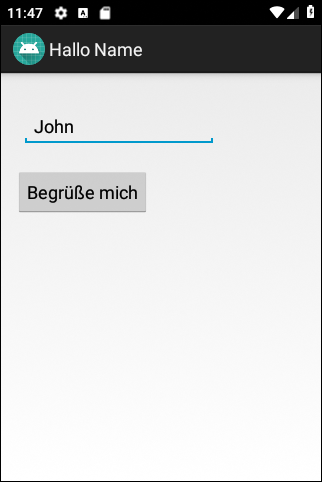
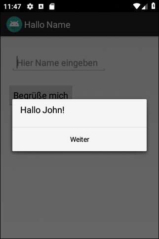
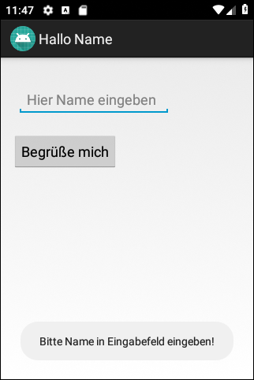

# Android-App "Hallo Name"

App demonstrates how to use dialog, toasts and log message in Android.

 

Identifiers (names for classes, variables and methods), UI texts and comments are in German only.

 

----
## Screenshots

  

 

----
# License

See the [LICENSE file](LICENSE.md) for license rights and limitations (BSD 3-Clause License).
